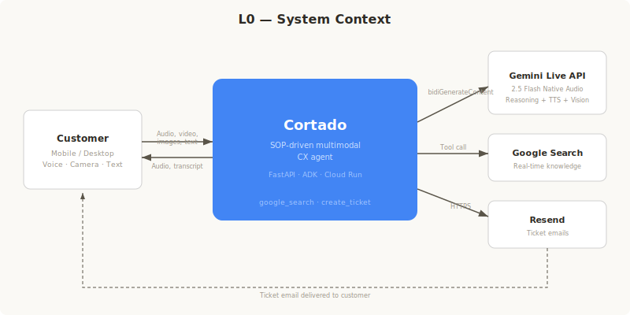
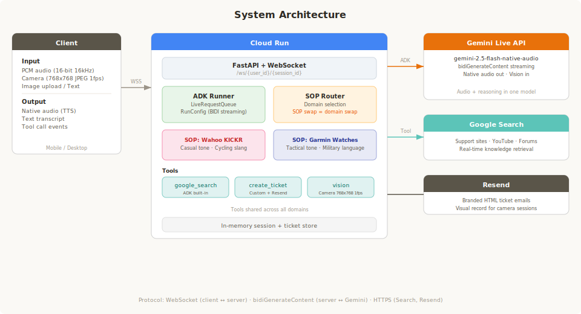
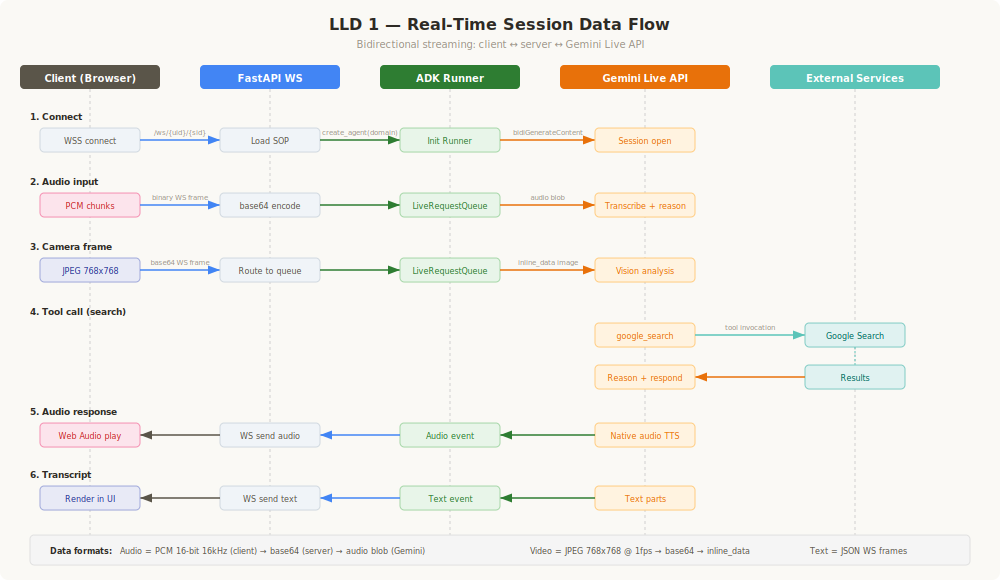
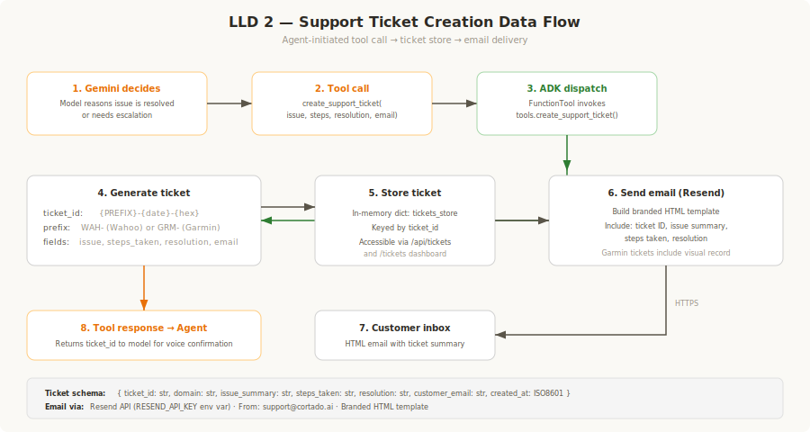

# Cortado — Multimodal CX, Cut to the Essentials

> **Do CX agents really need complex workflow trees? Or can an SOP, Google Search, and the Gemini Live API replace all of it?**

Cortado tests a hypothesis: give a multimodal agent an SOP (Standard Operating Procedure) instead of a workflow tree, let it search the web in real time, and see if it can handle customer support — voice, camera, images, and text — in a single session. No pre-embedded knowledge bases, no decision trees, no rigid routing.

The same infrastructure powers **completely different domains** — just swap the SOP. We demonstrate this with two agents: a friendly Wahoo cycling buddy and a tactical Garmin watch specialist.

Built for the [Gemini Live Agent Challenge](https://geminiliveagentchallenge.devpost.com/) by **Vasundra Srinivasan**, author of [*Data Engineering for Multimodal AI*](https://learning.oreilly.com/library/view/data-engineering-for/9781098190774/) (O'Reilly).

---

## The Insight

A new hire at a support team doesn't memorize every knowledge base article on day one. They get a training manual (SOP) that tells them how to behave, when to escalate, and where to look for answers. Then they figure it out.

Cortado works the same way:

- **SOP** (system prompt) → defines behavior, tone, personality, escalation rules, support procedures
- **Google Search** → agent searches official support sites, YouTube, and forums in real time
- **Gemini Live API** → customer speaks, shows camera, uploads images, types — all in one session
- **Gemini 2.5 Flash Native Audio** (via ADK) → reasons about the problem and guides to resolution
- **Support Tickets** → agent creates tickets and emails branded summaries via Resend

The agent's intelligence comes from the SOP + the model's ability to search and reason. No pre-embedded documents, no vector databases, no ingestion pipelines.

---

## Architecture

### L0 — System Context



Cortado sits between the customer and three external services. The customer connects over WebSocket from a mobile or desktop browser. Cortado routes all multimodal input (audio, camera, images, text) to the Gemini Live API for reasoning and native audio generation, uses Google Search for real-time knowledge retrieval, and sends branded ticket emails via Resend.

### System Architecture



The server runs on Cloud Run as a FastAPI application with WebSocket support. Incoming connections are routed through the ADK Runner, which manages a `LiveRequestQueue` per session and streams bidirectionally with the Gemini Live API (`bidiGenerateContent`). The SOP Router selects the domain-specific system prompt — same tools (`google_search`, `create_support_ticket`, `vision`), different behavior.

### LLD 1 — Real-Time Session Data Flow



Shows the complete bidirectional data path for a live session: client captures PCM audio (16-bit, 16kHz) and camera frames (JPEG 768x768 at 1fps), sends them over WebSocket, through FastAPI and the ADK Runner's `LiveRequestQueue`, to the Gemini Live API. The model reasons about the input, optionally invokes `google_search` for real-time knowledge, and streams back native audio (TTS) and text transcripts through the same path in reverse.

### LLD 2 — Support Ticket Creation Data Flow



Shows the agent-initiated ticket creation flow: the Gemini model decides to create a ticket (via `create_support_ticket` tool call), the ADK dispatches to `tools.py`, which generates a prefixed ticket ID (`WAH-` or `GRM-`), stores it in the in-memory ticket store (accessible via `/api/tickets` and the `/tickets` dashboard), sends a branded HTML email via Resend, and returns the ticket ID to the model for voice confirmation to the customer.

### Why This Architecture

| Decision | Rationale |
|---|---|
| **SOP, not workflows** | Behavior is defined by operating procedures, not decision trees. Swap the SOP → swap the entire domain. |
| **Google Search, not RAG** | Why pre-embed content that's already on the web? The agent searches in real time — always current, zero maintenance. |
| **Single context window** | Audio, video, text, and images flow into one `LiveRequestQueue`. The model sees everything together — like a human on a support call. |
| **Gemini Live API** | Real-time bidirectional streaming. The customer can interrupt (barge-in), the agent can ask "can you show me that?", natural conversation flow. |
| **Domain-agnostic** | Same tools (`google_search`, `create_support_ticket`) power any domain. The SOP is the only thing that changes — personality, tone, knowledge sources, visual behavior. |

---

## Domain Switching: Same Infra, Different Agent

Cortado proves that SOP-driven architecture is domain-agnostic by supporting two completely different support agents:

| | **Wahoo KICKR** | **Garmin Watches** |
|---|---|---|
| **Personality** | Friendly cycle buddy, slightly caffeinated | Marine tech sergeant, no-nonsense |
| **Tone** | "Hey! What's going on with your setup?" | "Cortado here. What's the situation?" |
| **Voice** | Casual, enthusiastic, uses cycling slang | Direct, tactical, uses military language |
| **Vision** | Identifies trainer models, reads LED states | Identifies watch models from images, visual damage assessment |
| **Ticket Email** | Standard summary | Includes visual record (image observations) |
| **Ticket Prefix** | WAH-XXXXXXXX | GRM-XXXXXXXX |
| **Knowledge Sources** | support.wahoofitness.com, Wahoo YouTube | support.garmin.com, Garmin Forums, DC Rainmaker |

**Zero code changes between domains.** Just a different SOP string.

---

## Technology Stack

| Component | Technology |
|---|---|
| Agent Framework | **Google ADK** (Streaming / Bidi) |
| Real-Time I/O | **Gemini Live API** (bidirectional WebSocket) |
| Language Model | **Gemini 2.5 Flash Native Audio** (`gemini-2.5-flash-native-audio-preview-12-2025`) |
| Knowledge | **Google Search** (real-time web + YouTube) |
| Tools | `google_search` (ADK built-in) + `create_support_ticket` (custom) |
| Email | **Resend** (branded HTML ticket summaries) |
| Backend | FastAPI + uvicorn |
| Frontend | Responsive HTML/CSS/JS (mobile-first, Web Audio API) |
| Deployment | **Cloud Run** + **Cloud Build** (automated IaC via `deploy.sh`) |

### Google Cloud Services
- **Cloud Run** — Hosts the FastAPI application with WebSocket support (HTTPS for mic/camera)
- **Cloud Build** — Automated container image builds from Dockerfile

---

## Features

- **Multimodal in one conversation** — Voice, camera, image upload, and text in a single session
- **Real-time web search** — Agent searches official support sites, YouTube, forums; no pre-embedded knowledge
- **Camera-based product identification** — Show your device, agent identifies the model visually
- **Support ticket creation** — Logs every interaction with ticket ID, emailed to customer
- **Branded email summaries** — HTML emails via Resend with ticket details and visual records
- **Domain switching** — Dropdown selector swaps between Wahoo and Garmin agents instantly
- **Barge-in / interruption** — Stop button to interrupt the agent mid-response
- **Vision honesty guardrails** — Agent admits when it can't clearly see something instead of guessing
- **Automated deployment** — Single script deploys to Cloud Run (IaC bonus)

---

## Quick Start

### Prerequisites
- Python 3.12+
- Gemini API key ([get one here](https://aistudio.google.com/apikey))
- (Optional) Resend API key for email ([resend.com](https://resend.com))

### Local Development

```bash
# Clone the repo
git clone https://github.com/cortado-ai/cortado.git
cd cortado

# Install dependencies
pip install -r requirements.txt

# Configure environment
cp .env.example .env
# Edit .env with your GOOGLE_API_KEY (and optionally RESEND_API_KEY)

# Run the server
cd app && python main.py
```

Open `http://localhost:8080` on your phone (same WiFi network) for mic + camera access.

### Deploy to Cloud Run (Automated)

```bash
chmod +x scripts/deploy.sh
./scripts/deploy.sh YOUR_PROJECT_ID YOUR_GEMINI_API_KEY [REGION]
```

This script:
1. Enables required GCP APIs (Cloud Run, Cloud Build, Artifact Registry, Generative Language)
2. Builds the container image via Cloud Build
3. Deploys to Cloud Run with HTTPS (required for mic/camera on mobile)
4. Sets environment variables (API keys, model config)
5. Prints the live HTTPS URL

---

## Project Structure

```
cortado/
├── app/
│   ├── main.py                    # FastAPI + WebSocket server + domain routing
│   ├── cortado_agent/
│   │   ├── agent.py               # SOPs (Wahoo + Garmin) + Agent factory
│   │   └── tools.py               # create_support_ticket + Resend email
│   ├── static/
│   │   ├── css/style.css          # Mobile-first responsive UI
│   │   ├── js/
│   │   │   ├── app.js             # WebSocket client + domain switching
│   │   │   ├── audio-player.js    # Audio playback (Web Audio API)
│   │   │   ├── audio-recorder.js  # Mic input (AudioWorklet)
│   │   │   ├── pcm-player-processor.js
│   │   │   └── pcm-recorder-processor.js
│   │   └── img/cortado-logo.png
│   └── templates/
│       ├── index.html             # Main support UI
│       └── tickets.html           # Ticket dashboard
├── scripts/
│   └── deploy.sh                  # Automated Cloud Run deployment (IaC)
├── docs/
│   └── architecture.svg           # Architecture diagram
├── Dockerfile
├── requirements.txt
├── .env.example
├── LICENSE                        # MIT
├── ARTICLE.md                     # Technical deep-dive article
└── README.md
```

---

## The SOP Approach vs. Traditional CX

| Traditional CX Bot | Cortado (SOP-Based) |
|---|---|
| Knowledge hardcoded in workflow nodes | Agent searches the web in real time |
| Separate voice/chat/image systems | One model, one context, all modalities |
| Workflow update required for every doc change | Docs change on the web → agent finds updated version |
| Months to build and maintain | SOP written in hours, agent handles the rest |
| Breaks when customer goes "off-script" | No script to go off of — agent reasons freely |
| One domain per bot | Swap the SOP → swap the entire domain |
| Generic tone for all products | Domain-specific personality (friendly vs. tactical) |

---

## API Endpoints

| Endpoint | Method | Description |
|---|---|---|
| `/` | GET | Main support agent UI |
| `/ws/{user_id}/{session_id}` | WebSocket | Bidirectional streaming (audio, text, images) |
| `/tickets` | GET | Support ticket dashboard |
| `/api/tickets` | GET | JSON API for tickets |
| `/api/domains` | GET | Available SOP domains |
| `/health` | GET | Health check for Cloud Run |

---

## Technical Article

See [ARTICLE.md](./ARTICLE.md) for a deep analysis of workflow-free multimodal CX architecture and how Cortado implements SOP-driven support.

---

## About the Author

**Vasundra Srinivasan** is the author of [*Data Engineering for Multimodal AI*](https://learning.oreilly.com/library/view/data-engineering-for/9781098190774/) (O'Reilly), covering architectures for building scalable multimodal AI systems. Cortado applies these principles to real-time customer experience.

---

## Credits & Costs

This project was built using **personal Gemini API credits** (self-funded). The hackathon GCP credit request deadline was missed, so no hackathon-provided credits were used. All API costs for development and demo were paid out of pocket.

---

## License

[MIT](./LICENSE)

---

*Built for the [Gemini Live Agent Challenge](https://geminiliveagentchallenge.devpost.com/) #GeminiLiveAgentChallenge*
